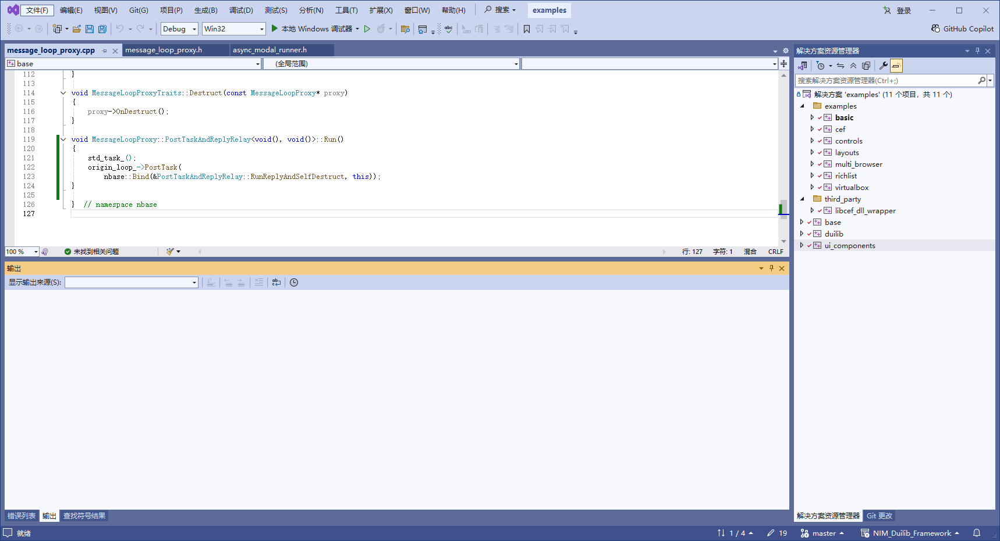

[TOC]

### duilib基础知识点

- 先使用vs项目模板创建桌面程序，作为初始化状态，在逐步增加

- 网易duilib 使用vs 2022使用默认字符集编译 调用时也要把解决方案设置为编译时字符集相同

  ### 要使用vs2022 创建基于网易云的duilib项目

  #### vs2022编译examples解决方案

##### vs2022打开examples.sln

##### 生成平台设置为win32

##### 设置debug模式的解决方案编译选项

##### 设置Release模式的解决方案编译选项

##### 全部解决方案按照上述步骤设置Debug和Release模式的编译选项

##### 编译错误解决

###### NIM_Duilib_Framework\ui_components\modal_wnd\async_modal_runner.h中friend class std::_Ref_count_obj修改为friend class std::_Ref_count_obj2

###### NIM_Duilib_Framework\ui_components\modal_wnd\async_modal_runner.h中private改为public

###### NIM_Duilib_Framework\base\framework\message_loop_proxy.h中的PostTaskAndReplyRelay剪切到NIM_Duilib_Framework\base\framework\message_loop_proxy.cpp

##### 编译完成创建空白项目

##### 引入解决解决方案依赖

##### 引入base解决方案

##### 引入duilib解决方案

##### 解决方案资源管理器显示如下表示引入成功

##### 设置解决方案编译选项

##### 设置解决方案字符集和编译duilib时字符集保持一致

##### 设置输出目标平台

##### 设置链接子系统

##### 添加包含目录

##### 添加库目录

##### 添加库文件

##### 设置库链接模式为静态链接库调试模式

##### basic_form窗体代码复制到项目

##### main.h和basic_form.h头文件引入,引入后如下，手打代码 输入#include<   会自动提示

##### 复制布局文件到生成exe目录

##### 运行exe

##### 从项目demo复制为basic_form_demo，手动修改复制后的basic_form_demo

##### 打开复制后的sln，提示找不到demo解决方案，删除demo解决方案，保存basic_form_demo解决方案

##### 添加新的解决方案basic_form_demo

##### 生成新的解决方案，默认vs2022架构是x64每次都要手动设置为x86

#### 解决方案显示所有文件

